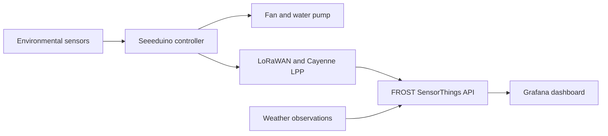

# IoT Smart Mushroom Growing Box

An IoT prototype for monitoring and regulating the environment inside a small mushroom growing box. The system combines local sensing, LoRaWAN data transmission, dashboard monitoring, and threshold-based control of a fan and water pump.

This was a group project completed in 2025 for **Geo Sensor Networks and the Internet of Things** at the Technical University of Munich (TUM).


## Project overview

The prototype measured the growing environment and used the readings to support automatic control:

- a BME680 sensor measured air temperature, humidity, pressure, and gas-related signals;
- a TSL2561 sensor measured light intensity;
- a capacitive moisture sensor provided relative readings from the growing medium;
- a Seeeduino LoRaWAN board encoded and transmitted observations using Cayenne LPP;
- a fan and water pump responded to temperature and humidity thresholds;
- FROST stored the observations, while Grafana displayed the time series together with external weather data.



## Hardware prototype

The complete setup combined the growing enclosure with the controller, antenna, LCD, relays, ventilation fan, water pump, and environmental sensors.


The main components were:

| Component | Role |
| --- | --- |
| Seeeduino LoRaWAN and Grove base shield | Sensor acquisition, control logic, and wireless transmission |
| BME680 | Air temperature, humidity, pressure, and gas-related measurements |
| TSL2561 | Illuminance measurements |
| Capacitive moisture sensor | Relative moisture readings from the growing medium |
| Relays, ventilation fan, and water pump | Environmental control |
| RGB LCD | Local status display |

Inside the enclosure, the BME680, TSL2561, and capacitive moisture sensor monitored the air, light, and growing medium respectively. The annotated interior view identifies them as components 7, 8, and 9.


## Control logic

The team refined the thresholds through literature review and observation of the box:

- the fan switched on above **22.1 °C**;
- the pump switched on when measured air humidity fell below **40%**;
- local sensor data were transmitted approximately every 30 seconds during the course setup.

The humidity threshold was based on the behavior of the physical prototype. The team observed that maintaining 50–60% air humidity required excessive watering, while approximately 40% already kept the bottom of the box wet. These thresholds are specific to this prototype and should be recalibrated for a different enclosure, substrate, or sensor configuration.


## Data platform and visualization

The course deployment mapped the incoming Cayenne LPP channels to SensorThings entities in FROST. The public course server still exposes the project Thing and its observations through the SensorThings API:

- [Group 23 mushroom box Thing](https://gi3.gis.lrg.tum.de/frost/v1.1/Things(573))
- [box temperature](https://gi3.gis.lrg.tum.de/frost/v1.1/Datastreams(1507)), [soil moisture](https://gi3.gis.lrg.tum.de/frost/v1.1/Datastreams(1508)), [illuminance](https://gi3.gis.lrg.tum.de/frost/v1.1/Datastreams(1670)), [indoor air quality](https://gi3.gis.lrg.tum.de/frost/v1.1/Datastreams(1671)), and [box humidity](https://gi3.gis.lrg.tum.de/frost/v1.1/Datastreams(1673));
- [Munich weather temperature](https://gi3.gis.lrg.tum.de/frost/v1.1/Datastreams(1665)) and [humidity](https://gi3.gis.lrg.tum.de/frost/v1.1/Datastreams(1666)) used for the indoor/outdoor comparison.

A scheduled GitHub Actions workflow requested current Munich conditions from WeatherAPI and posted them to FROST every five minutes. Grafana then compared outdoor weather with the box measurements. The course [Grafana service](https://gi3.gis.lrg.tum.de/grafana/) now redirects to its login page; the original dashboard screenshot is preserved below because the presentation did not contain a recoverable dashboard UID or public share link.


The [`frost/`](frost/) directory contains the channel mapping reconstructed from the submitted code screenshots and a utility for downloading the archived observations. The [`weather_uploader.py`](automation/weather_uploader.py) and disabled workflow example reproduce the documented weather-to-FROST process without exposing the original API key.

## Cultivation outcome

The prototype supported environmental monitoring, wireless data transmission, automatic fan and pump control, and a complete mushroom growth cycle. Daily photos and environmental records were used to compare growth with changes in temperature and moisture.


The experiment also revealed limits of the enclosure. The fan and watering system could not fully compensate for sustained outdoor heat, while the box had no active heating during colder periods. Insulation, passive ventilation, and improved imaging were identified as useful extensions.

## Repository contents

```text
.
├── firmware/
│   ├── README.md
│   ├── examples/
│   └── smart_mushroom_box/
│       ├── secrets.example.h
│       └── smart_mushroom_box.ino
├── frost/
│   ├── README.md
│   ├── channel_mapping.example.js
│   └── download_observations.py
├── automation/
│   ├── README.md
│   ├── weather-upload.example.yml
│   └── weather_uploader.py
└── docs/figures/
```

The repository contains a cleaned, credential-free version of the integrated Arduino firmware, four early hardware test sketches, the FROST channel mapping recovered from the final presentation, and a reproducible weather-upload example. The original LoRaWAN and WeatherAPI credentials are intentionally excluded.

## Team

- Yi Zhao
- Xiaoxiao Wang
- Ziyu Hu

The project was developed collaboratively at TUM. The repository documents the shared course outcome and preserves the public, reusable part of the implementation.
