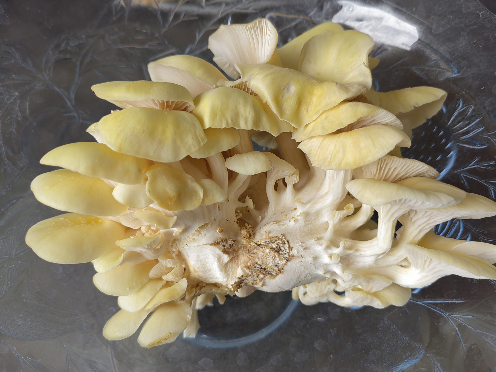
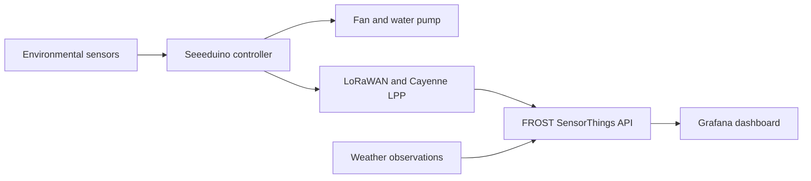
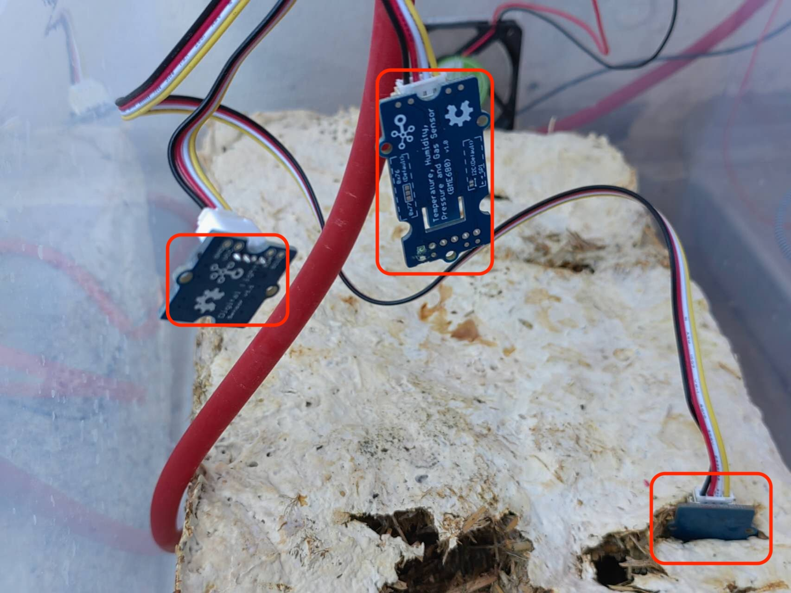
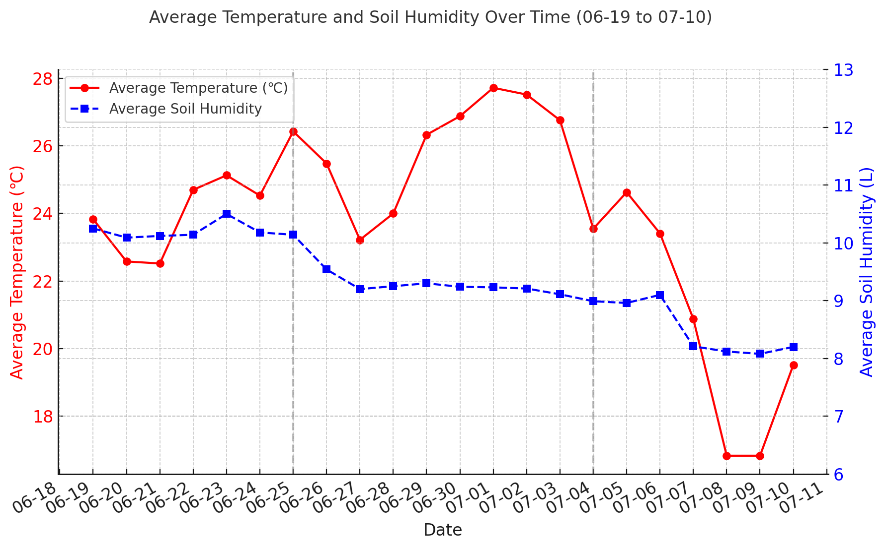
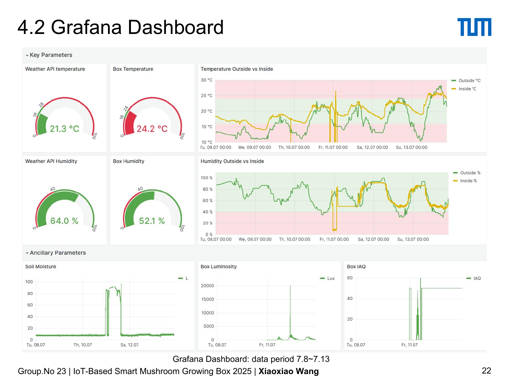
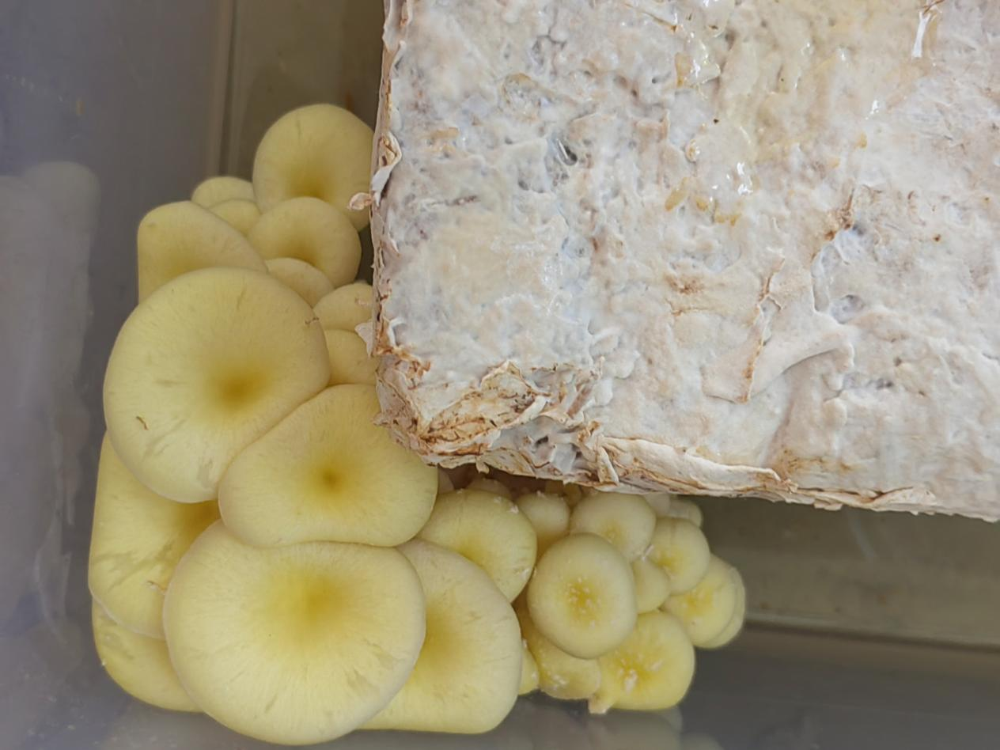

# IoT Smart Mushroom Growing Box

An IoT prototype for monitoring and regulating the environment inside a small mushroom growing box. The system combines local sensing, LoRaWAN data transmission, dashboard monitoring, and threshold-based control of a fan and water pump.

This was a group project completed in 2025 for **Geo Sensor Networks and the Internet of Things** at the Technical University of Munich (TUM).



## Project overview

The prototype measured the growing environment and used the readings to support automatic control:

- a BME680 sensor measured air temperature, humidity, pressure, and gas-related signals;
- a TSL2561 sensor measured light intensity;
- a capacitive moisture sensor provided relative readings from the growing medium;
- a Seeeduino LoRaWAN board encoded and transmitted observations using Cayenne LPP;
- a fan and water pump responded to temperature and humidity thresholds;
- FROST stored the observations, while Grafana displayed the time series together with external weather data.



## Hardware prototype

The box combined the controller, antenna, LCD, relays, fan, pump, and environmental sensors in one working setup.



The main components were:

| Component | Role |
| --- | --- |
| Seeeduino LoRaWAN and Grove base shield | Sensor acquisition, control logic, and wireless transmission |
| BME680 | Air temperature, humidity, pressure, and gas-related measurements |
| TSL2561 | Illuminance measurements |
| Capacitive moisture sensor | Relative moisture readings from the growing medium |
| Relays, ventilation fan, and water pump | Environmental control |
| RGB LCD | Local status display |

## Control logic

The team refined the thresholds through literature review and observation of the box:

- the fan switched on above **22.1 °C**;
- the pump switched on when measured air humidity fell below **40%**;
- local sensor data were transmitted approximately every 30 seconds during the course setup.

The humidity threshold was based on the behavior of the physical prototype. The team observed that maintaining 50–60% air humidity required excessive watering, while approximately 40% already kept the bottom of the box wet. These thresholds are specific to this prototype and should be recalibrated for a different enclosure, substrate, or sensor configuration.



## Data platform and visualization

The course deployment mapped the incoming Cayenne LPP channels to SensorThings entities in FROST. A scheduled data-upload workflow added weather observations, and Grafana displayed both indoor and outdoor conditions.



## Cultivation outcome

The prototype supported environmental monitoring, wireless data transmission, automatic fan and pump control, and a complete mushroom growth cycle. Daily photos and environmental records were used to compare growth with changes in temperature and moisture.



The experiment also revealed limits of the enclosure. The fan and watering system could not fully compensate for sustained outdoor heat, while the box had no active heating during colder periods. Insulation, passive ventilation, and improved imaging were identified as useful extensions.

## Repository contents

```text
.
├── firmware/
│   ├── README.md
│   └── smart_mushroom_box/
│       ├── secrets.example.h
│       └── smart_mushroom_box.ino
└── docs/figures/
```

The repository contains a cleaned, credential-free version of the final Arduino prototype code. The live FROST, Grafana, weather-service, and LoRaWAN infrastructure belonged to the course deployment and is not reproduced here.

## Team

- Yi Zhao
- Xiaoxiao Wang
- Ziyu Hu

The project was developed collaboratively at TUM. The repository documents the shared course outcome and preserves the public, reusable part of the implementation.

