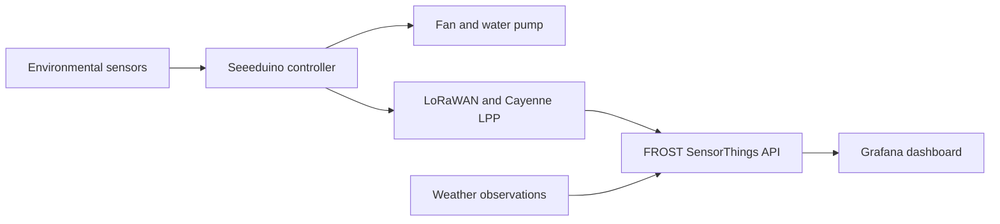
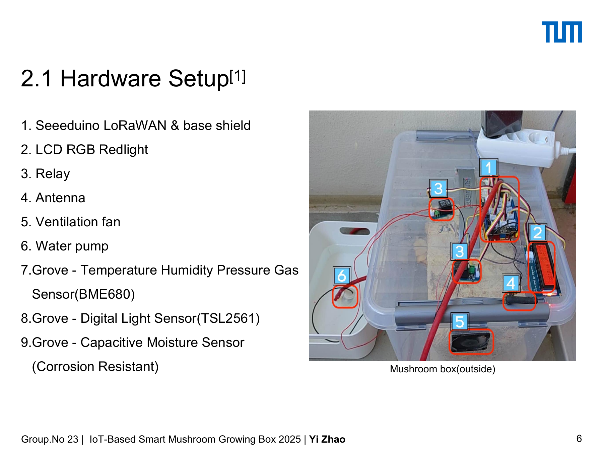
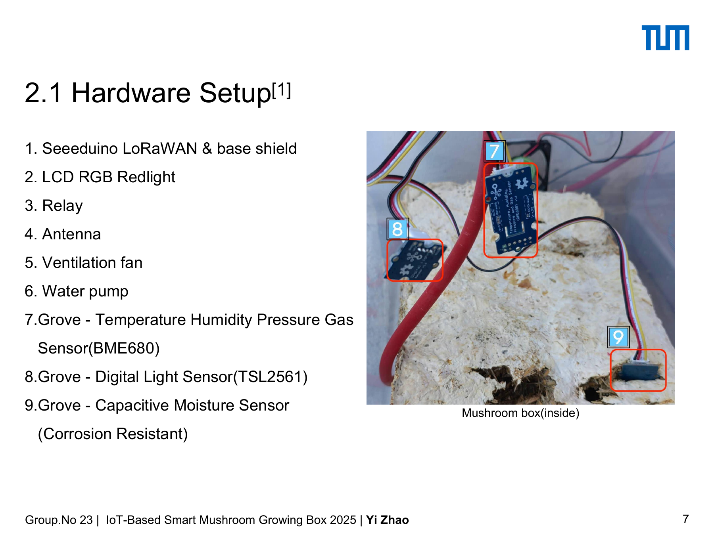

# IoT Smart Mushroom Growing Box

An IoT prototype for monitoring and regulating the environment inside a small mushroom growing box. The system combines local sensing, LoRaWAN data transmission, dashboard monitoring, and threshold-based control of a fan and water pump.

This was a group project completed in 2025 for **Geo Sensor Networks and the Internet of Things** at the Technical University of Munich (TUM).

For a complete rebuild sequence covering hardware, Arduino, LoRaWAN, FROST, WeatherAPI, and Grafana, see the **[reproduction guide](REPRODUCING.md)**.


## Project overview

The prototype measured the growing environment and used the readings to support automatic control:

- a BME680 sensor measured air temperature, humidity, pressure, and gas-related signals;
- a TSL2561 sensor measured light intensity;
- a capacitive moisture sensor provided relative readings from the growing medium;
- a Seeeduino LoRaWAN board encoded and transmitted observations using Cayenne LPP;
- a fan and water pump responded to temperature and humidity thresholds;
- FROST stored the observations, while Grafana displayed the time series together with external weather data.



## Hardware prototype

The complete setup combined the growing enclosure with the controller, antenna, LCD, relays, ventilation fan, water pump, and environmental sensors.



The main components were:

| Component | Role |
| --- | --- |
| Seeeduino LoRaWAN and Grove base shield | Sensor acquisition, control logic, and wireless transmission |
| BME680 | Air temperature, humidity, pressure, and gas-related measurements |
| TSL2561 | Illuminance measurements |
| Capacitive moisture sensor | Relative moisture readings from the growing medium |
| Relays, ventilation fan, and water pump | Environmental control |
| RGB LCD | Local status display |

Inside the enclosure, the BME680, TSL2561, and capacitive moisture sensor monitored the air, light, and growing medium respectively. The annotated interior view identifies them as components 7, 8, and 9.



## Arduino firmware

The Arduino code used to operate the prototype is included in [`firmware/`](firmware/). The integrated sketch reads the environmental sensors, displays local status, controls the fan and water pump, packages measurements with Cayenne LPP, and transmits them through LoRaWAN.

| File | Purpose |
| --- | --- |
| [`smart_mushroom_box.ino`](firmware/smart_mushroom_box/smart_mushroom_box.ino) | Integrated sensing, actuator control, LCD display, Cayenne LPP encoding, and LoRaWAN transmission |
| [`secrets.example.h`](firmware/smart_mushroom_box/secrets.example.h) | Credential template for local LoRaWAN configuration |
| [`bme680_test.ino`](firmware/examples/bme680_test/bme680_test.ino) | BME680 environmental-sensor test |
| [`light_sensor_test.ino`](firmware/examples/light_sensor_test/light_sensor_test.ino) | TSL2561 illuminance-sensor test |
| [`soil_moisture_test.ino`](firmware/examples/soil_moisture_test/soil_moisture_test.ino) | Capacitive moisture-sensor test |
| [`lcd_test.ino`](firmware/examples/lcd_test/lcd_test.ino) | Grove RGB LCD test |

Setup requirements and library dependencies are documented in the [firmware guide](firmware/README.md). Device identifiers and the LoRaWAN AppKey are loaded locally through `secrets.h`, which is excluded from the public repository.

The end-to-end [reproduction guide](REPRODUCING.md) provides the bill of materials, pin assignments, recorded library versions, Cayenne channel definitions, cloud configuration, verification steps, and experimental procedure.

## Control logic

The team refined the thresholds through literature review and observation of the box:

- the fan switched on above **22.1 °C**;
- the pump switched on when measured air humidity fell below **40%**;
- local sensor data were transmitted approximately every 30 seconds during the course setup.

The humidity threshold was based on the behavior of the physical prototype. The team observed that maintaining 50–60% air humidity required excessive watering, while approximately 40% already kept the bottom of the box wet. These thresholds are specific to this prototype and should be recalibrated for a different enclosure, substrate, or sensor configuration.


## Data platform and visualization

Incoming Cayenne LPP messages were mapped to SensorThings Datastreams in FROST. The channel configuration, API metadata, and data access utility are stored in [`frost/`](frost/).

| Measurement | LPP channel | Datastream | Saved metadata |
| --- | ---: | ---: | --- |
| Box temperature | 1 | 1507 | [JSON](frost/snapshots/datastream_1507_box_temperature.json) |
| Growing-medium moisture | 2 | 1508 | [JSON](frost/snapshots/datastream_1508_soil_moisture.json) |
| Illuminance | 3 | 1670 | [JSON](frost/snapshots/datastream_1670_box_illuminance.json) |
| Indoor air quality | 4 | 1671 | [JSON](frost/snapshots/datastream_1671_indoor_air_quality.json) |
| Box humidity | 5 | 1673 | [JSON](frost/snapshots/datastream_1673_box_humidity.json) |
| Munich temperature | — | 1665 | [JSON](frost/snapshots/datastream_1665_weather_temperature.json) |
| Munich humidity | — | 1666 | [JSON](frost/snapshots/datastream_1666_weather_humidity.json) |

The complete [Thing metadata](frost/snapshots/thing_573.json) is also included. Current observations can be downloaded from the [live SensorThings endpoint](https://gi3.gis.lrg.tum.de/frost/v1.1/Things(573)) with `frost/download_observations.py`.

A scheduled GitHub Actions workflow requested current Munich conditions from WeatherAPI and posted them to FROST every five minutes. Grafana compared the outdoor observations with the box measurements and displayed the soil moisture, illuminance, and indoor air quality series. The panel-to-Datastream configuration is documented in [`grafana/`](grafana/), together with the [course Grafana service](https://gi3.gis.lrg.tum.de/grafana/).


The [`weather_uploader.py`](automation/weather_uploader.py) and workflow definition in [`automation/`](automation/) implement the WeatherAPI-to-FROST data flow with credentials supplied through environment variables.

## Cultivation outcome

The prototype supported environmental monitoring, wireless data transmission, automatic fan and pump control, and a complete mushroom growth cycle. Daily photos and environmental records were used to compare growth with changes in temperature and moisture.


The experiment also revealed limits of the enclosure. The fan and watering system could not fully compensate for sustained outdoor heat, while the box had no active heating during colder periods. Insulation, passive ventilation, and improved imaging were identified as useful extensions.

## Repository contents

```text
.
├── firmware/
│   ├── README.md
│   ├── examples/
│   └── smart_mushroom_box/
│       ├── secrets.example.h
│       └── smart_mushroom_box.ino
├── frost/
│   ├── README.md
│   ├── channel_mapping.js
│   └── download_observations.py
├── automation/
│   ├── README.md
│   ├── weather-upload.yml
│   └── weather_uploader.py
├── grafana/
│   ├── README.md
│   └── dashboard_data_mapping.json
├── docs/figures/
└── REPRODUCING.md
```

The repository contains a credential-free version of the integrated Arduino firmware, four hardware test sketches, the FROST channel mapping and metadata, a SensorThings data downloader, and the weather-upload automation. LoRaWAN and WeatherAPI credentials are supplied locally and are excluded from version control.

## Team

- Yi Zhao
- Xiaoxiao Wang
- Ziyu Hu

The project was developed collaboratively at TUM. The repository documents the shared course outcome and preserves the public, reusable part of the implementation.
